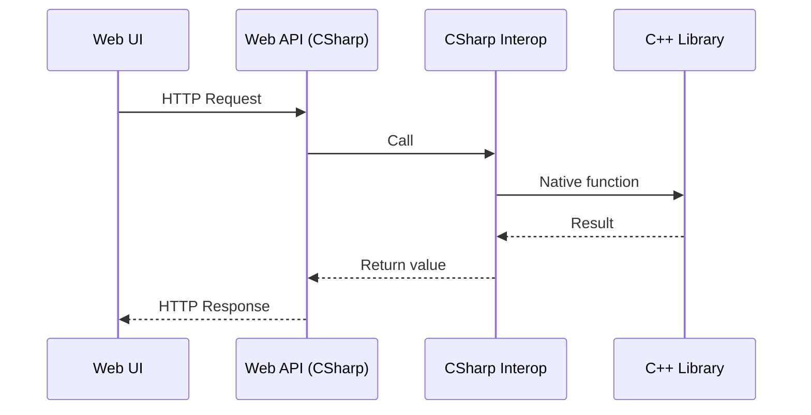

# Sample .NET 9 Web API Application with C++ Interop and Docker

This repository contains a sample .NET 9 application written in C#.  
The project demonstrates how requests flow from the Web API to a native C++ library through a C# interop layer, and how the entire application can be containerized with Docker.

The application structure:
- **C++ library** (`cpp_lib/`) — provides core functionality.
- **Interop service** (`StringService/`) — bridges C# code with the C++ library.
- **Web API (ASP.NET Core)** (`web-ui/`) — exposes endpoints for the web UI through a controller (`web-ui/Controllers/`), forwarding requests to the C++ library.
- **Web UI** (`web-ui/wwwroot/`) — a simple web page that interacts with the Web API.
- **Docker configuration** (`Dockerfile`) — builds & deploys the whole project in a container.
- **Tests** (`tests/`) — various tests.

