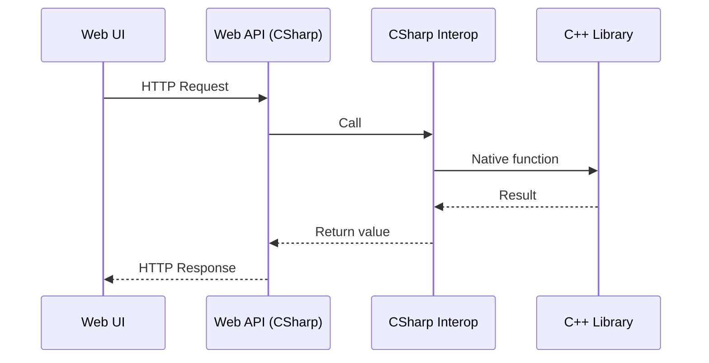

# Sample .NET 9 Web API Application with C++ Interop and Docker

This repository contains a sample .NET 9 application written in C#.  
The project demonstrates how requests flow from the Web API to a native C++ library through a C# interop layer, and how the entire application can be containerized with Docker.

The application structure:
- **C++ library** (`CppLibrary/`) — provides core functionality.
- **Interop service** (`StringService/`) — bridges C# code with the C++ library.
- **Web API (ASP.NET Core)** (`web-ui/`) — exposes endpoints for the web UI through a controller (`web-ui/Controllers/`), forwarding requests to the C++ library.
- **Web UI** (`web-ui/wwwroot/`) — a simple web page that interacts with the Web API.
- **Docker configuration** (`Dockerfile`) — builds & deploys the whole project in a container.
- **Tests** (`tests/`) — various tests.



## Prerequisites

Before running the project, make sure your environment has the required tools installed.

### .NET 9 SDK

As of August 2025, .NET 9 SDK is not yet available out-of-the-box or via standard Linux package managers. To install it, run the provided script:

```bash
sh install_dotnet9.sh
```

This script uses the official Microsoft installer to download and configure .NET 9.
After running it, the `dotnet` command will be available for building and running the project.

### Test libraries and tools

TODO: Some tests require additional native libraries or tools to run correctly out-of-the-box. Update this section and/or installation scripts.

## How to run

### Run locally

0. Open a terminal.
1. Switch folder
```bash 
cd src/web-ui
```
2. Run 
```bash 
sh dotnet_run.sh
``` 
4. The .NET 9 Web API application will be built and started.
5. In the Codespaces interface, either click "Open in browser" in a popup dialog or click **Ports** and forward the port your Web API is using (default: 5000). Then, click the **Open in Browser** link next to the forwarded port to access the web page.

### Run with Docker

0. Open a terminal.
1. Switch folder
```bash
cd src/
```
2. Run 
```bash 
sh docker_run.sh
```
3. Docker container will be built and deployed.
4. In the Codespaces interface, either click "Open in browser" in a popup dialog or click **Ports** and forward the port your Web API is using (default: 8080). Then, click the **Open in Browser** link next to the forwarded port to access the web page.

## How to test

0. Open a terminal.
1. Switch folder
```bash
cd src/tests
```
2. Run
```bash 
sh run_all_tests.sh
```
Note: browser tests (`test/BrowserTests`) needs a .NET application running from another terminal before the tests start. 